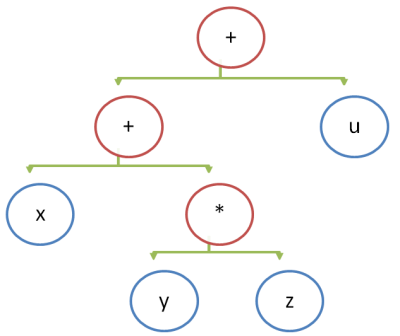

## Пример рекурсивного спуска на C++

Этот пример показывает, как разобрать арифметическое выражение в естественном формате из строки в структуру данных "дерево", а затем путём обхода подсчитать результат вычисления выражения. Пример намеренно написан в процедурном стиле.

Вывод программы:

```
'404' = 404
'   404  ' = 404
'3 * 3 * 3' = 27
'12 / 12 / 12' = 0.0833333
'25 + 17 / 45 / 2' = 25.1889
'42 + 42 / 2 * 2' = 84
' 4 * 4 + 3 * 3 + 2 * 2 ' = 29
```

Ссылки:

- [Recursive descent parser (en.wikipedia.org)](https://en.wikipedia.org/wiki/Recursive_descent_parser)
- [Compiler Design - Top-Down Parser](http://www.tutorialspoint.com/compiler_design/compiler_design_top_down_parser.htm)

## Дерево выражений

В большинстве языков символ бинарного оператора ставится между его операндами, например: `x + y * z + u`. Порядок выполнения операций определяется неявным приоритетом операторов и явно расставленными скобками. Расставим все скобки явно: `((x + (y * z)) + u)` (мы пренебрегли правилом ассоциативности, по которому `(a + b) + c = a + (b + c)`).

После явной расстановки скобок можно составить эквивалентное дерево, при обходе которого слева нараво вычисления будут выполнены корректно.



В BNF нотации выглядит реализованная грамматика выражений так:

```
// a * b + c / b
expression ::= add_sub_expr

add_sub_expr ::= mul_div_expr '+' add_sub_expr
    | mul_div_expr '-' add_sub_expr
    | mul_div_expr

mul_div_expr ::= atom_expr '*' mul_div_expr
    | atom_expr '/' mul_div_expr
    | atom_expr '%' mul_div_expr
    | atom_expr

atom_expr ::= [0-9]+
```
